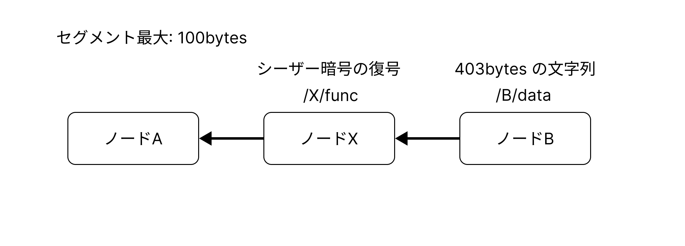

# セグメント分割の動作確認

## 概要

ローカルで実行。セグメント100bytes上限。



`node_c_consumer.cpp` にてリクエストを送信。

### データ
403bytesのデータ。
```
/B/data: Vhsg sgd qzohc hmbqdzrd hm sgd mtladq ne HnS cduhbdr hm qdbdms xdzqr, sgd deedbshud tshkhyzshnm zmc lzmzfdldms ne sgdrd cduhbdr gzr adbnld hmbqdzrhmfkx hlonqszms. Hm ozqshbtkzq, HnS sdbgmnknfx hr adhmf trdc hm z vhcd qzmfd ne zookhbzshnmr, hmbktchmf rlzqs bhshdr, sgd ztsnlnshud hmctrsqx, zmc sgd ldchbzk ehdkc, vghbg qdpthqd kzqfd zlntmsr ne czsz zmc ghfg-roddc oqnbdrrhmf fdmdqzsdc ax sghr sdbgmnknfx.
```

### 期待する出力
```
With the rapid increase in the number of IoT devices in recent years, the effective utilization and management of these devices has become increasingly important. In particular, IoT technology is being used in a wide range of applications, including smart cities, the automotive industry, and the medical field, which require large amounts of data and high-speed processing generated by this technology.
```

## 実験

### コンテナ構築

```
docker compose up
```

### コンテナに入る
```
docker compose run ndn-node-a bash
docker compose run ndn-node-b bash
docker compose run ndn-node-c bash
```

### 実行

```node-a
sh /work/NDN-original/sh_local/setup.sh
nfd-start
sh /work/NDN-original/sh_local/node_a_start.sh
```

```node-b
sh /work/NDN-original/sh_local/reinstall.sh
nfd-start
sh /work/NDN-original/sh_local/node_b_start.sh
```

```node-c
sh /work/NDN-original/sh_local/reinstall.sh
nfd-start
sh /work/NDN-original/sh_local/node_c_start.sh
```