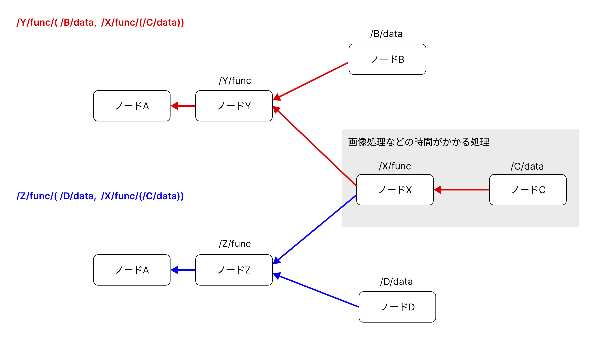

# キャッシュの有効性チェック

## 概要

ローカルで実行。



`node_a_consumer.cpp` にてリクエストを送信。

`/Y/func/( /B/data,  /X/func/(/C/data))` へリクエストし、2秒あけて `/Z/func/( /D/data,  /X/func/(/C/data))` へリクエストするを繰り返して検証。

※ 同時にリクエストしてしまうと、`/X/func/(/C/data)` の処理を同時に要求してしまいキャッシュが使えないので2秒あけている。

`work/NDN-original/ndn-cxx/examples/base_producer.hpp` の `disableCache` を切り替えてキャッシュありとなしを検証。


## 実験

### コンテナ構築

```
docker compose up
```

### コンテナに入る
```
docker compose run ndn-node-a bash
docker compose run ndn-node-b bash
docker compose run ndn-node-c bash
```

### 実行

```node-a
sh /work/NDN-original/sh_local/setup.sh
nfd-start
sh /work/NDN-original/sh_local/node_a_start.sh
```

```node-b
sh /work/NDN-original/sh_local/reinstall.sh
nfd-start
sh /work/NDN-original/sh_local/node_b_start.sh
```

```node-c
sh /work/NDN-original/sh_local/reinstall.sh
nfd-start
sh /work/NDN-original/sh_local/node_c_start.sh
```

```node-a(consumer)
sh /work/NDN-original/sh_local/reinstall.sh
nfd-start
sh /work/NDN-original/sh_local/node_a_consumer_start.sh
```