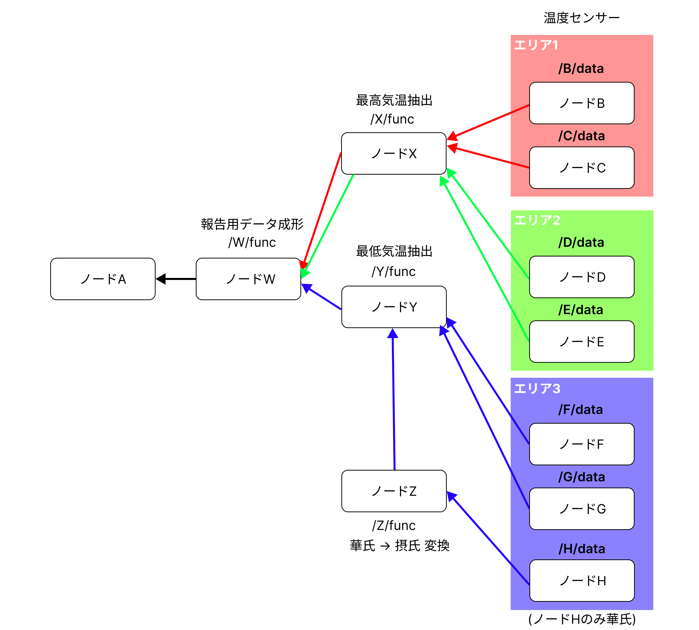

# 複雑なチェイン処理の動作確認

## 概要

ローカルで実行。



`node_c_consumer.cpp` にてリクエストを送信。

## 温度設定と期待する出力

```
データ
/B/data: 22.6
/C/data: 21.3
/D/data: -1.2
/E/data: -15.1
/F/data: 13.1
/G/data: 14.1
/H/data: 50.2

報告結果のテンプレ(/W/func での整形で期待する形)
報告結果: {data1}℃, {data2}℃, ... {dataN}℃

期待する出力
報告結果: 22.600000℃, -1.200000℃, 10.111111℃
```

## 実験

### コンテナ構築

```
docker compose up
```

### コンテナに入る
```
docker compose run ndn-node-a bash
docker compose run ndn-node-b bash
docker compose run ndn-node-c bash
```

### 実行

```node-a
sh /work/NDN-original/sh_local/setup.sh
nfd-start
sh /work/NDN-original/sh_local/node_a_start.sh
```

```node-b
sh /work/NDN-original/sh_local/reinstall.sh
nfd-start
sh /work/NDN-original/sh_local/node_b_start.sh
```

```node-c
sh /work/NDN-original/sh_local/reinstall.sh
nfd-start
sh /work/NDN-original/sh_local/node_c_start.sh
```