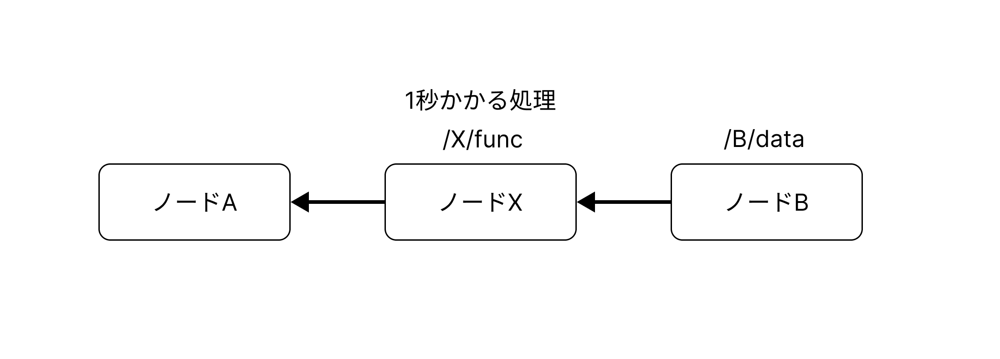

# キャッシュの動作確認

## 概要

ローカルで実行。



`node_c_consumer.cpp` にてリクエストを送信。

```
データ
/B/data: B_DATA
```

## 実験

### コンテナ構築

```
docker compose up
```

### コンテナに入る
```
docker compose run ndn-node-a bash
docker compose run ndn-node-b bash
docker compose run ndn-node-c bash
```

### 実行

```node-a
sh /work/NDN-original/sh_local/setup.sh
nfd-start
sh /work/NDN-original/sh_local/node_a_start.sh
```

```node-b
sh /work/NDN-original/sh_local/reinstall.sh
nfd-start
sh /work/NDN-original/sh_local/node_b_start.sh
```

```node-c
sh /work/NDN-original/sh_local/reinstall.sh
nfd-start
sh /work/NDN-original/sh_local/node_c_start.sh
```