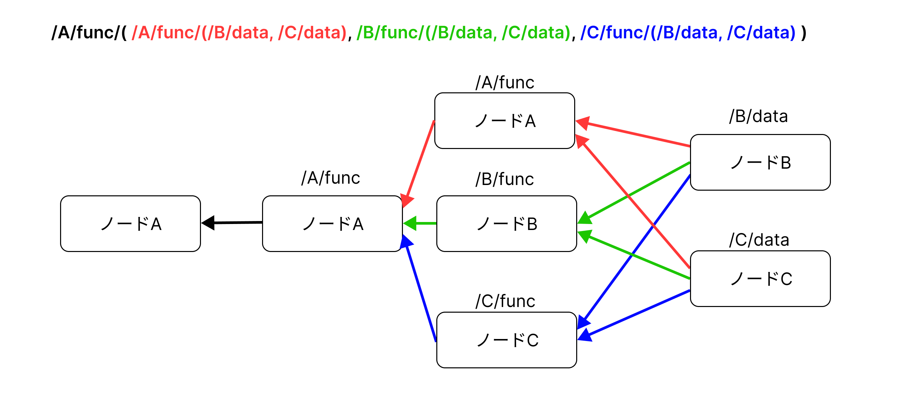

# 複数リソースの並列処理による高速化評価

## 概要

リソースが関わる実験なので k8s 上で実行。



ノードA, B, CにおけるファンクションはCPUリソースを酷使し単体で動かすと1sほどかかるもの(ハッシュを100万回計算するやつ)を設置。

ひとつのワーカーノードにすべてのノードをデプロイして実行する場合(シングル)と3つのワーカーノードにそれぞれのノードをデプロイして実行する場合(マルチ)で処理速度を比較。

コンテナは立てたらIPを確認して `node_a_start.sh`, `node_b_start.sh`, `node_c_start.sh` でやっている create face の IP を対応するものに変更する必要がある。

`node_a_consumer` でリクエストしており、実験対象以外もさまざまなリクエストが入っているがいくつか試して最も有効なものを探していただけである。

結果としては一番最後のやつだけでOK。


## 実験

### コンテナ作成
```
# マルチで実験する場合
kubectl apply -f ./k8s/multi

# シングルで実験する場合
kubectl apply -f ./k8s/single
```

### コンテナに入る
```
kubectl get pods
kubectl exec -it ポッド名 -- /bin/bash
```

### それぞれにコードを持ってくる

```
cd /home
git clone https://github.com/kobayashiharuto/NDN-FC-WorkflowPlus.git
git switch parallel-optimization 
export PKG_CONFIG_PATH="/home/NDN-FC-WorkflowPlus/work/NDN-original"
```

```A_producer
cd /home/NDN-FC-WorkflowPlus/work/NDN-original/sh_k8s/
sh rebuild.sh
nfd-start
sh node_a_start.sh
```

```_B
cd /home/NDN-FC-WorkflowPlus/work/NDN-original/sh_k8s/
sh rebuild.sh
nfd-start
sh node_b_start.sh
```

```_C
cd /home/NDN-FC-WorkflowPlus/work/NDN-original/sh_k8s/
sh rebuild.sh
nfd-start
sh node_c_start.sh
```


```A_consumer
/home/NDN-FC-WorkflowPlus/work/NDN-original/ndn-cxx/build/examples/node_a_consumer
```